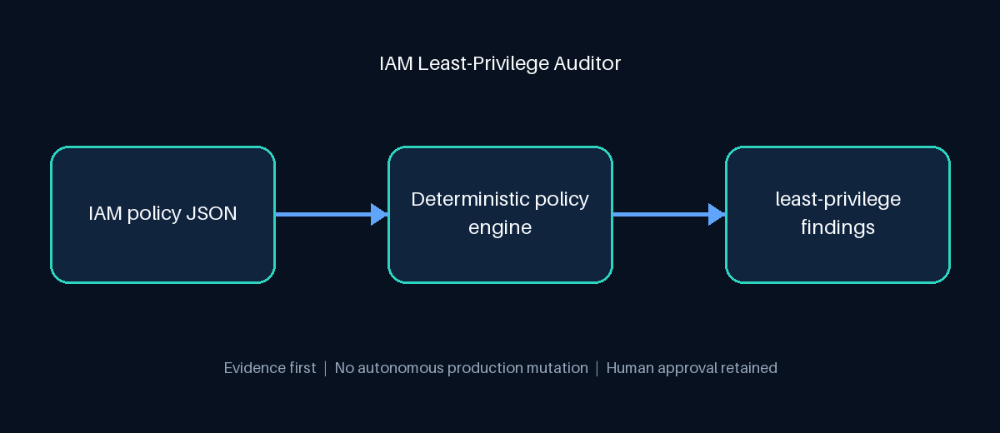

# Building an Approval-First IAM Least-Privilege Auditor

Cloud access rarely becomes dangerous because a team intends to grant unlimited permissions. It usually happens through small exceptions: a wildcard during an incident, an overly broad deployment role, or a policy copied forward without another review.

Those exceptions matter because IAM defines the blast radius of every workload and human identity. A compromised principal with `iam:PassRole` or broad service permissions can turn one foothold into a much larger incident.

For Day 2 of my 30-day Cloud + AI portfolio series, I built the **IAM Least-Privilege Auditor**, a read-only Python guardrail that converts AWS IAM policy JSON into deterministic, explainable findings.

## The design decision: evidence before automation

The project deliberately separates analysis from infrastructure mutation. It does not connect to AWS, rewrite policies, or approve a deployment. Instead, it parses the proposed policy and gives the reviewer evidence they can test and audit.

The current rules detect:

- global and service-level action wildcards;
- global resource wildcards;
- privilege-escalation actions used against every resource;
- inverse allow-lists created with `NotAction`;
- broad access without a limiting condition.

Each finding contains a statement index, rule identifier, severity, evidence, and remediation recommendation. The final report also includes severity counts, a bounded risk score, and an explicit approval recommendation.

## Why deterministic rules come first

An AI model can help explain a policy, summarize a report, or propose narrower permissions. It should not be the only control deciding whether production access is safe. The security decision in this project is ordinary Python code with unit tests, which makes the result reproducible and reviewable.

That creates a clean orchestration boundary:

1. deterministic code identifies evidence;
2. optional AI can translate that evidence for different audiences;
3. a human retains authority over the infrastructure-impacting action.

## Testing the risky paths

The unit suite covers global wildcards, service wildcards, `iam:PassRole`, `NotAction`, safely scoped policies, and deny statements. GitHub Actions runs the suite and audits a synthetic sample on every push and pull request.

The sample deliberately contains `s3:*` and `iam:PassRole` against `Resource: "*"`. It contains no credentials and never calls a cloud account.

## Using it safely in a delivery pipeline

A real pipeline can export a proposed policy from its plan or build stage and run the auditor before the deployment gate. If findings exist, the report becomes evidence for a protected-environment approval. Cloud credentials and the deployment command remain outside the auditor.

This is not a replacement for AWS IAM Access Analyzer, SCP evaluation, permission-boundary analysis, or a full effective-permissions graph. It is a focused demonstration of how deterministic policy controls, CI, and human-in-the-loop AI orchestration can work together.

## What I learned

The most important lesson was architectural: good automation does not remove responsibility. It makes the evidence clearer, the decision faster, and the boundary around production change harder to ignore.

The complete implementation, tests, sample policy, architecture visual, and safe deployment guidance are available in the project repository.
